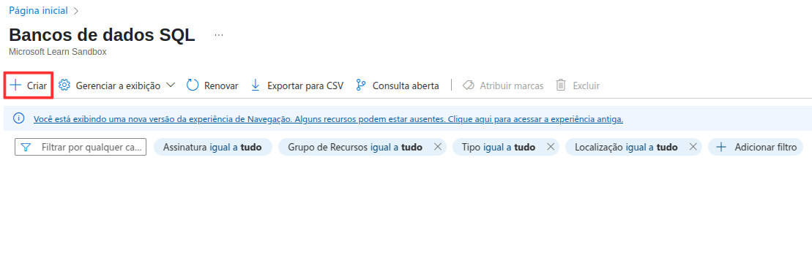
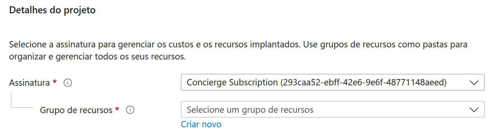
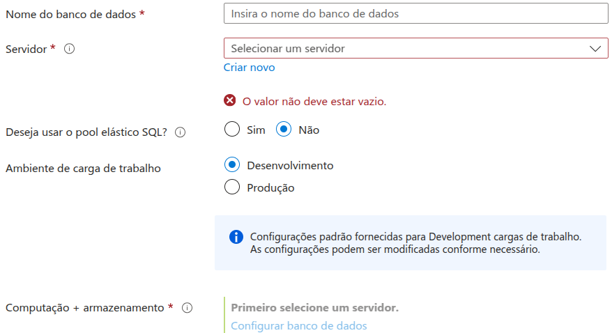

# Criação básica de banco de dados no Microsoft Azure utilizando o portal

1-Acesse o portal do Microsoft Azure.

2-Busque pelo serviço nomeado de “Banco de Dados SQL” que pode ser encontrado na página inicial ou no painel de serviços.

3-Selecione o botão “Criar” para abrir o menu de Banco de Dados SQL.

4-Na guia “Básico” selecione uma assinatura.

5-Também escolha um grupo de recursos.

6-Preencha o nome do banco de dados.

7-Selecione uma opção de servidor de bancos de dados a ser utilizada (caso não apareça nenhuma, é necessário criar).

8-Deixe a opção pool elástico SQL como “não” se deseja criar um banco de dados independente.

9-Escolha entre a opção de ambiente de carga de “desenvolvimento” ou “produção”.

10-Defina a opção de redundância do armazenamento de backup entre “redundância local”, “redundância de zona” e “redundância geográfica”. Lembre-se que isso afetará o SLA.

11-Visualize a previsão de custo desse banco de dados.

12-Caso a previsão esteja adequada para seu uso, selecione o botão de “Revisar + criar”.

- É possível continuar a configuração de outras opções antes de criar o banco de dados por meio das guias “Rede”, “Segurança”, “Configurações adicionais” e “Rótulos”.

